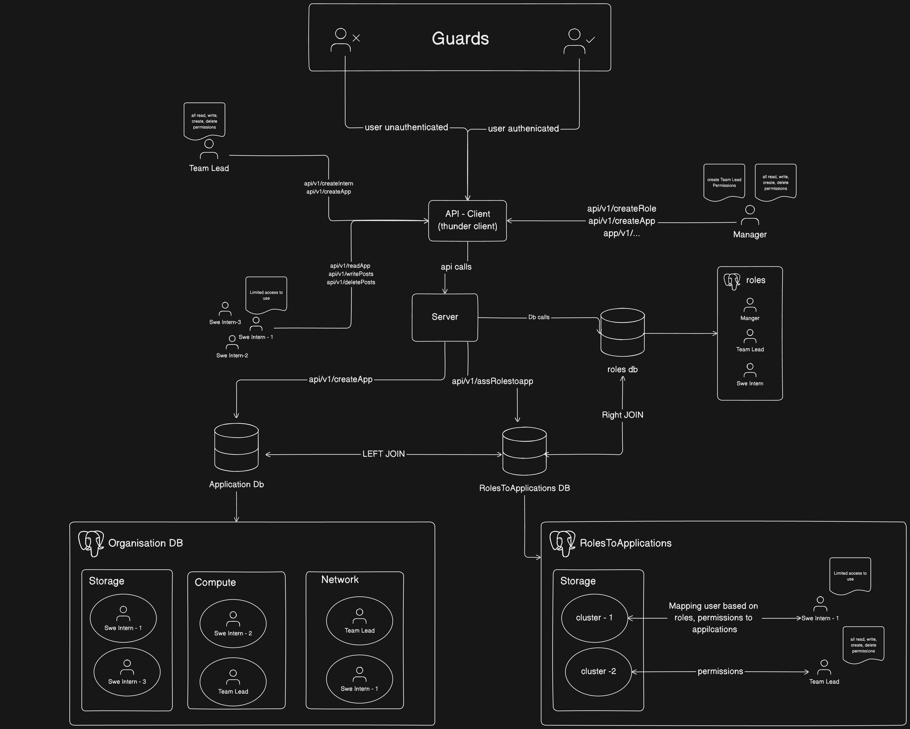

# 👮‍♂️ Gate Master : Multi-Tenant Role Based Access Control (RBAC) Authenication Framework

Gate Master API is a  Role-based access control (RBAC) refers to the idea of assigning permissions to users based on their role within an organization. 
It offers a simple, manageable approach to access management that is less prone to error than assigning permissions to users individually.

When using RBAC for Role Management, you analyze the needs of your users and group them into roles based on common responsibilities.
You then assign one or more roles to each user and one or more permissions to each role. 

For example, if you were using RBAC to control access for an HR application, you could give HR managers a role that allows them to update employee details, while other employees would be able to view only their own details.

This project illuminates the creation of a multi-tenant application(eg: HR application, shopify store), providing guidance on user registration, role assignment, and permission management. 
With a strong focus on security and scalability, the final phase centers on permission validation using a guard mechanism. 

### Architecture design

## 🚀 Features

- Application Creation: Establish various applications such as HR application or Shopify stores or resources in an organization.
- User Registration: Enable user subscription to applications, like subscribing to a Shopify Store or acessing a resource in organization.
- User Authentication: Facilitate user login functionality for secure access.
- Role Creation: Define roles tailored to specific applications or resources for effective user management.
- Role Assignment: Assign roles to users to streamline access and responsibilities.
- Permission Verification: Utilize guard mechanisms to verify user permissions effectively.

## 🛠️ Main Technologies
* `Typescript`
* `Postgress SQL`
* `Fastify`
* `Drizzle ORM`
* `Thunder Client` (REST client)
* `Express.js & Express.js middleware`

## Helpful files
- CMD - Commands used in the video
- api.json - Thunder Client collection

## 📝 Process

## 🤔 How Can It Be Improved?

## Data flow

## Let's keep in touch
- [Twitter](https://twitter.com/saikiran_arch)
- [LinkedIn](https://www.linkedin.com/in/saikiranannam)